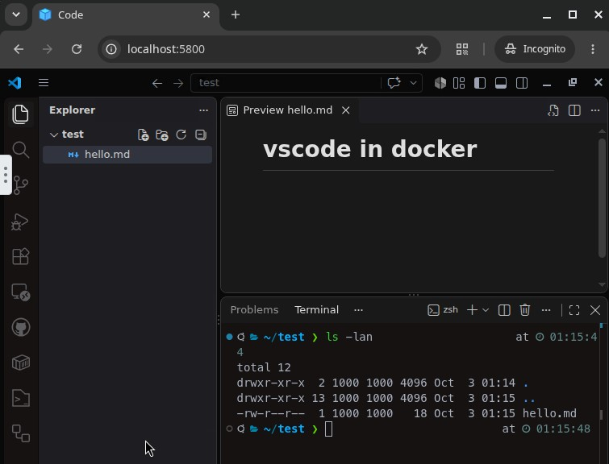

# VS Code in a Container

The desktop version of VS Code in a Docker container, used through a web browser (noVNC) or a VNC client.

Built on [jlesage/docker-baseimage-gui](https://github.com/jlesage/docker-baseimage-gui).



## Go

```sh
docker compose up -d --build
```

- Web: http://localhost:5800
- VNC: `localhost:5900`

## Home

The user `app` has a normal home at `/home/app`, with zsh as its login shell. VS Code, its terminal and file dialogs start there. VS Code's settings and extensions, git/gh config and the projects all live in this folder.

## Volumes

| Volume          | Mount       | Content                                                        |
| --------------- | ----------- | -------------------------------------------------------------- |
| `vscode-home`   | `/home/app` | User home: VS Code settings and extensions, dotfiles, projects |
| `vscode-config` | `/config`   | Base image state: logs, certificates, web login                |

## Environment

| Variable                           | Default (compose) | Description                                                     |
| ---------------------------------- | ----------------- | --------------------------------------------------------------- |
| `TZ`                               | `Europe/Berlin`   | Time zone                                                       |
| `USER_ID` / `GROUP_ID`             | `1000` / `1000`   | UID/GID of the user `app`; files in the home are owned by these |
| `DISPLAY_WIDTH` / `DISPLAY_HEIGHT` | `1920` / `1080`   | Resolution of the virtual screen                                |
| `KEEP_APP_RUNNING`                 | `1`               | Restart VS Code automatically when it is closed or crashes      |
| `WEB_FILE_MANAGER`                 | `1`               | File manager in the web interface (upload/download)             |
| `WEB_FILE_MANAGER_ALLOWED_PATHS`   | `/home/app`       | Paths the web file manager can access                           |
| `AUTO_UPDATE`                      | `1`               | Update VS Code on container start                               |
| `VSCODE_OPEN`                      | *(unset)*         | Folder to open on every start; unset = restore the last session |
| `VNC_PASSWORD`                     | *(unset)*         | Password for VNC and the web interface                          |

The base image supports more variables (dark mode, web authentication, etc.). See its [README](https://github.com/jlesage/docker-baseimage-gui#environment-variables).

## VS Code updates

VS Code is updated on every container start, before it launches. If the latest version is already installed, nothing is downloaded. If the update fails (no network, timeout), the installed version starts instead.

- Turn it off with `AUTO_UPDATE=0`.
- Update by hand from the terminal with `vscode-update`, then restart VS Code.

## zsh

[oh-my-zsh](https://github.com/ohmyzsh/ohmyzsh) with the [powerlevel10k](https://github.com/romkatv/powerlevel10k) theme and these plugins:
- [zsh-autosuggestions](https://github.com/zsh-users/zsh-autosuggestions)
- [zsh-syntax-highlighting](https://github.com/zsh-users/zsh-syntax-highlighting)
- [zsh-completions](https://github.com/zsh-users/zsh-completions)

The MesloLGS NF font is installed for the prompt.

All of this is copied into the home on first start, so you can update it yourself with `omz update`. `p10k configure` runs the first time you open a terminal.

## GitHub sign-in

The container has no web browser, so sign in with a device code: VS Code shows a code that you enter at https://github.com/login/device in any browser. Set this in VS Code's `settings.json`:

```json
"github-authentication.preferDeviceCodeFlow": true
```
